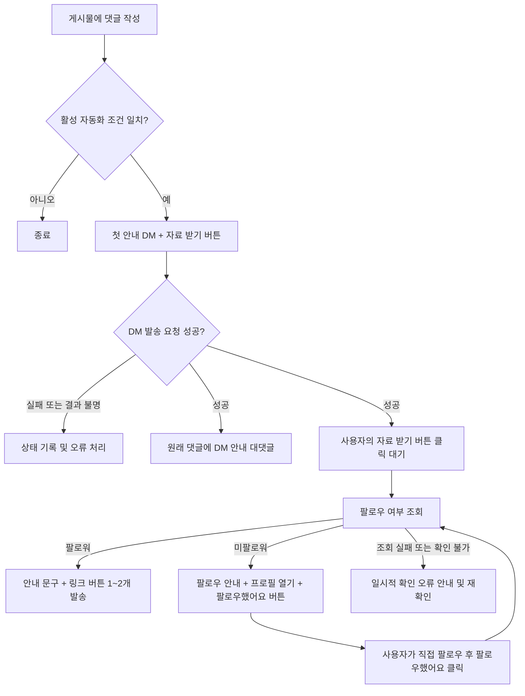

# HOOKIT STUDIO — 인스타그램 댓글 · DM 자동화

인스타그램 댓글 자동화를 제공하는 **구독형 웹 서비스(SaaS)**다. 처음에는 서비스 운영자 본인의 계정으로 사용하고 검증하며, 이후 고객이 같은 사이트에 로그인해 자신의 인스타그램 계정을 연결하여 사용한다. 처음부터 고객별 데이터와 권한을 분리한다.

게시물에 특정 단어가 포함된 댓글 또는 아무 댓글이 달리면 안내 DM을 보내고, 사용자가 버튼을 누르면 연결된 인스타그램 계정의 팔로우 여부를 확인하여 자료 링크를 전달한다. 첫 안내 DM 발송이 성공하면 원래 댓글에 발송 안내 대댓글도 남긴다.

현재 단계는 **React 웹 프로젝트와 Firebase 서버 초안 구현**이다. 아래 기획 내용은 목표 사양이며 모두 운영 검증이 끝났다는 뜻은 아니다. 실제 Meta 계정 연결·발송 검증은 아직 진행하지 않았다.

## 빠른 실행

```powershell
npm install
npm run dev
```

`http://127.0.0.1:5173`에서 설정된 로컬 계정으로 **로그인 하기**를 누르면 6개 화면을 확인할 수 있다. Firebase가 없는 로컬 개발에서는 서버에서 아이디·비밀번호를 검증한 뒤 샘플 작업공간에 들어간다. 실제 DM은 보내지 않으며 변경한 자동화 설정은 브라우저에 저장된다. 로컬 로그인 설정은 Git에서 제외되는 `.local/auth.json`에 솔트와 해시로 저장하고 브라우저에 제공하지 않는다.

프런트엔드는 **React + TypeScript + Vite**, 인증·DB는 **Firebase Authentication + Firestore**, 서버는 **Render Free Web Service**에서 실행할 수 있도록 독립 Node 서버로 이전했다. 실제 Render 배포와 Meta 실계정 검증은 아직 완료하지 않았다. [무료 서버 배포 안내](docs/RENDER.md)를 참고한다. 작은 컴포넌트·훅·서비스 모듈로 분리했다. 서비스 브랜드는 **HOOKIT STUDIO**다. 기존 미디어 프로덕션 명함의 블루(#205BFF)와 원형 심볼을 연결하되, 사이트는 화이트 배경과 블루 포인트를 기본으로 한다.

실제 연동 설정, 최초 계정 준비, 현재 제한과 테스트 명령은 **[개발 및 연결 안내](docs/SETUP.md)**에 정리했다. 환경변수 예시는 [.env.example](.env.example), 서버 설정 예시는 [functions/.env.example](functions/.env.example)이다.

현재 실제 발송은 서버의 비공개 검증 설정으로 꺼져 있다. OAuth·웹훅·팔로우 조회·발송 코드가 있지만 실제 계정에서 검증한 뒤 활성화해야 한다. 회원가입·고객 관리·구독 관리는 아직 구현하지 않았다.

**현재 개발 목표는 본인이 바로 사용할 수 있는 1차 버전이다.** 회원가입, 고객 계정 관리, 구독 기간 관리 및 결제는 2차 회원가입·판매 단계로 미룬다. 1차에는 소유권을 구분할 작업공간 구조만 유지하고 고객 관리 기능을 미리 만들지 않는다.

## 1. 확정된 요구사항

- 장기적으로 구독형 서비스로 판매한다. 1차는 본인 사용에 집중하되 사용자와 작업공간을 구분하여 추후 확장 가능하게 구성한다.
- 1차에는 미리 준비한 본인 계정으로 로그인만 제공한다. 회원가입과 운영자의 고객 계정·구독 기간 관리는 2차에서 함께 만든다.
- 프런트엔드는 React를 사용하며, 컴포넌트를 작은 책임 단위로 나누어 작업한다.
- Firebase는 Spark 요금제로 로그인·DB·Hosting에 사용한다. 자동화 서버는 별도 무료 실행 환경으로 이전하며 유료 요금제 전환을 전제로 하지 않는다.
- 게시물별로 `특정 단어 댓글` 또는 `모든 댓글`을 자동화 시작 조건으로 설정한다.
- 첫 DM에 안내 문구와 버튼을 함께 보낸다.
- 사용자가 버튼을 누르면 운영 계정의 팔로우 여부를 확인한다.
- 미팔로워에게는 팔로우 요청 메시지를 보낸다.
- 팔로워에게는 안내 내용과 URL 버튼을 함께 보낸다. 링크는 1개 또는 2개다.
- 첫 DM 발송 성공 후 원래 댓글에 “DM을 보냈어요”라는 취지의 대댓글을 자동으로 남긴다.
- DM 문구, 버튼 이름, 링크, 대댓글 문구는 관리 화면에서 변경할 수 있게 한다.
- 1차 DB에는 작업공간별 캠페인 설정, 자동화 진행 상태와 발송 이력을 저장한다. 발송 기록은 수신자 확인과 중복 방지에 사용한다. 구독 정보와 관리 기능은 2차에 추가한다.

### 서비스 이용 주체

| 주체 | 역할 |
| --- | --- |
| 서비스 운영자 | 1차에는 본인 계정으로 자동화 사용. 2차에 고객 계정·구독 기간 관리 추가 |
| 구독 고객 | 2차 판매 대상. 자신의 인스타그램 연결, 캠페인 설정, 발송 내역 확인 |
| 댓글 작성자 | 고객 게시물에 댓글을 남기고 인스타그램 DM으로 자료 수신. 이 서비스에 가입하거나 로그인할 필요 없음 |

고객별 설정과 데이터를 묶는 단위를 `작업공간(workspace)`으로 정의한다. 초기에는 작업공간당 고객 사용자 1명과 인스타그램 계정 1개를 기본으로 하되, 코드에 특정 사용자나 계정을 고정하지 않는다. 본인도 동일한 고객 작업공간을 사용한다.

## 2. 사용자 흐름



대댓글 발송과 버튼 클릭 대기는 첫 DM 성공 후 별개로 진행한다. 대댓글이 실패해도 이미 보낸 DM의 버튼은 계속 사용할 수 있어야 한다.

### 메시지 예시

| 단계 | 메시지 | 버튼 및 동작 |
| --- | --- | --- |
| 첫 안내 DM | 요청하신 자료를 준비했어요. 아래 버튼을 누르면 팔로우 여부를 확인하고 보내드릴게요. | `자료 받기` → 서버에서 팔로우 확인 |
| 미팔로워 안내 | 자료는 팔로워에게 제공하고 있어요. 계정을 팔로우한 뒤 아래 확인 버튼을 눌러주세요. | `프로필 열기` → 운영 계정 / `팔로우했어요` → 다시 확인 |
| 팔로워에게 자료 전달 | 확인됐어요! 아래에서 자료를 확인하세요. | `자료 보기` → URL 1 / 선택적으로 `추가 자료` → URL 2 |
| 확인 실패 | 지금은 팔로우 상태를 확인하지 못했어요. 잠시 후 다시 확인해주세요. | `다시 확인` → 재조회 |
| 공개 대댓글 | 안내 DM을 보냈어요! 보이지 않으면 메시지 요청함도 확인해주세요. | 버튼 없음 |

`자료 받기`, `팔로우했어요`, `다시 확인`은 서버로 이벤트를 전달하는 버튼으로 설계한다. 실제 자료 URL은 팔로우 확인 후 보내는 메시지에만 포함한다. 프로필 링크를 여는 동작과 서버에서 상태를 확인하는 동작은 구분한다.

## 3. 보완할 동작과 제안 기본값

아래는 사용자가 따로 지정하지 않은 부분에 대한 초안이다. 구현 전에 변경할 수 있다.

### 댓글 조건

- 1차 지원 대상: 운영 계정이 소유한 일반 게시물과 릴스의 최상위 댓글.
- 게시물 하나당 활성 자동화 하나를 기본으로 하여 여러 규칙의 동시 발송을 막는다.
- 특정 단어 모드에서는 키워드를 여러 개 등록하고 하나라도 일치하면 실행한다.
- 일치 방식은 `포함`을 기본으로 하고 `전체 일치`도 선택할 수 있게 한다.
- 비교 시 앞뒤 공백 제거, 유니코드 정규화, 영문 대소문자 무시를 적용한다. 내부 공백을 무조건 제거하거나 유사어를 추측하지 않는다.
- 모든 댓글 모드는 키워드 없이 실행하며 이모지 댓글도 포함한다.
- 운영자 자신의 댓글과 서비스가 남긴 대댓글은 제외한다.
- 자동화 활성화 이후 작성된 새 댓글을 처리한다. 과거 댓글 일괄 발송은 초기 범위에서 제외한다.
- 초안 저장, 활성화, 일시정지를 제공한다. 일시정지하면 아직 발송하지 않은 작업과 후속 링크 발송도 중단한다.

### 중복 및 재시도

- 같은 댓글 웹훅이 재전송되어도 첫 DM과 대댓글을 중복 발송하지 않는다.
- 기본값은 `같은 사용자 + 같은 캠페인`에 첫 안내 DM 1회다. 같은 게시물에 반복 댓글을 달아도 새 안내를 계속 보내지 않는다.
- 반복 댓글에는 대댓글도 추가하지 않는다. 다른 게시물의 별도 캠페인은 독립적으로 처리한다.
- 버튼을 연속 클릭해도 링크 메시지는 캠페인별 사용자당 1회만 발송한다.
- 미팔로워의 재확인은 허용하되 짧은 간격의 반복 요청에는 대기 시간을 둔다.
- 명확한 일시적 API 오류에는 제한된 횟수로 간격을 늘려 재시도한다.
- 요청 시간 초과처럼 실제 발송 여부가 불분명한 경우에는 `결과 불명`으로 기록한다. 무조건 재발송하여 메시지를 중복시키지 않는다.
- 대댓글만 실패한 경우 대댓글 작업만 재시도하며 첫 DM을 다시 보내지 않는다.

### 팔로우 확인

- 팔로우는 사용자가 인스타그램에서 직접 한다.
- 팔로우 후 DM으로 돌아와 `팔로우했어요` 버튼을 누르면 상태를 재조회하는 것을 기본으로 한다.
- 버튼을 눌렀다는 사실만으로 팔로워로 인정하지 않는다. API가 실제 팔로우 상태를 반환해야 한다.
- 조회 결과는 `팔로워 / 미팔로워 / 확인 불가`로 구분한다. API 오류를 미팔로우로 처리하지 않는다.
- 확인 불가 상태에서는 자료를 보내지 않고 재확인 경로를 제공한다.
- 팔로우 직후 반영 지연이 있을 수 있으므로 같은 안내를 무한 반복하지 않고 잠시 후 재확인하도록 안내한다.
- 여러 게시물의 DM 버튼을 눌러도 각 버튼이 원래 캠페인의 자료를 전달하도록 연결한다.
- 발송 직전에 자동화 활성 상태와 캠페인 유효성을 다시 확인한다.

## 4. API 사전 검증 — 가장 먼저 할 작업

**핵심 검증 목표는 실제 계정에서 ‘첫 DM 버튼 → 팔로우 조회 → 조건부 링크 발송’이 끝까지 가능한지 확인하는 것이다.** 관리 화면을 본격적으로 만들기 전에 이 흐름부터 검증한다.

2026-10-06 문서 조사에서 Meta 공식 Postman 자료의 일반 메시지 템플릿 지원은 확인했다. 다만 Meta 개발자 사이트 일부는 접속 제한(429)으로 본문 확인에 실패했다. 아래의 상세 권한, 필드, 시간 제한은 최신 공식 문서와 실제 API 응답으로 확정해야 한다. 확인하지 못한 기능을 구현 가능하거나 검증 완료라고 표시하지 않는다.

| 검증 항목 | 확인할 내용 | 완료 기준 |
| --- | --- | --- |
| 계정과 인증 방식 | 프로페셔널 계정 유형, Instagram Login 또는 Facebook Login 중 필요한 기능을 지원하는 방식 | 운영 계정 연결 및 필요한 권한 확인 |
| 댓글 이벤트 | 댓글 수신, 게시물·댓글·작성자 식별, 자체 댓글 제외 | 테스트 댓글이 한 번만 처리됨 |
| 최초 DM | 댓글 기반 Private Reply에서 안내 문구와 버튼을 함께 보낼 수 있는 정확한 형식 | 대화 이력이 없는 사용자에게 버튼 포함 DM 도착 |
| 버튼 이벤트 | 버튼 클릭의 postback 수신과 후속 메시지 허용 조건 | 클릭 사용자를 식별하고 후속 DM 발송 성공 |
| 팔로우 조회 | User Profile API의 `is_user_follow_business` 필드 지원 여부, 조회 가능한 사용자 및 동의·상호작용 조건 | 실제 팔로워/미팔로워가 각각 정확히 구분됨 |
| 팔로우 재확인 | 미팔로워가 팔로우한 후 재조회할 때 상태가 반영되는지 | 재확인 버튼으로 링크 단계까지 진행 |
| 최종 링크 | 문구와 URL 버튼 1개 또는 2개 구성 | 모바일에서 두 링크가 각각 정상적으로 열림 |
| 대댓글 | 원래 댓글에 공개 답글 발송 | 첫 DM 성공 건에만 안내 대댓글 생성 |
| 메시징 제한 | 최초 Private Reply 횟수·기한과 후속 DM 가능 시간, 호출량 제한 | 제한을 넘는 작업은 발송하지 않음 |
| 공개 운영 조건 | 앱 모드, 접근 수준, 앱 심사 및 사업자 인증 필요 여부 | 앱 역할이 없는 일반 댓글 작성자로 전체 흐름 검증 |

시간 제한 검토 시에는 `댓글당 최초 Private Reply 1회 / 댓글 후 7일 이내 / 사용자 응답 후 일반 메시징 24시간`을 우선 재확인한다. **이 수치는 이번 조사에서 공식 본문을 직접 재확인하지 못했으므로 확정된 운영 설정으로 취급하지 않는다.** 최초 댓글, DM 발송, 사용자 응답, URL 열기는 서로 다른 이벤트이며 모두가 후속 발송 시간을 열어준다고 가정하지 않는다.

일반 Send API에서 버튼 템플릿을 지원한다는 사실만으로 최초 Private Reply에도 동일한 형식이 지원된다고 단정하지 않는다. 지원되지 않는 경우 텍스트 답장으로 시작하는 대안을 별도로 검토하되, 사용자가 원하는 버튼 흐름을 충족한 것으로 간주하지 않는다.

실제 팔로우 조회가 선택한 인증 방식에서 불가능하면 인증 방식과 권한을 먼저 재검토한다. 자기 신고 버튼이나 팔로워 수 변화 추정으로 대체하여 핵심 요구사항을 만족한 것처럼 처리하지 않는다.

초기 본인 계정 검증과 구독 고객의 계정 연결 검증을 구분한다. 외부 고객이 자기 인스타그램을 연결하고 일반 댓글 작성자에게 메시지를 보내는 데 필요한 앱 모드·접근 수준·심사 조건을 판매 개시 전에 확인한다.

## 5. 1차 페이지 구성

**6가지 페이지**를 만든다. 자동화 생성·수정은 같은 편집 화면을 재사용한다. 첫 사용 순서는 `로그인 → 인스타그램 연결 → 자동화 만들기 → 미리보기·검증 → 활성화 → 발송 내역 확인`이다.

| 페이지 | 경로 제안 | 목적과 주요 내용 |
| --- | --- | --- |
| 로그인 | `/login` | 미리 준비한 본인 계정으로 이메일·비밀번호 로그인 |
| 대시보드 | `/dashboard` | 연결 상태, 활성 자동화, 오늘 발송 현황과 최근 오류를 한눈에 확인 |
| 자동화 목록 | `/automations` | 게시물별 자동화 목록, 상태, 생성·편집·복제·일시정지 |
| 자동화 만들기·수정 | `/automations/new`, `/automations/:id/edit` | 게시물부터 DM·팔로우 안내·자료 링크·대댓글까지 설정 |
| 발송 내역 | `/deliveries` | 누구에게 무엇을 언제 보냈는지, 어디서 대기하거나 실패했는지 확인 |
| 인스타그램 연결·설정 | `/settings/instagram` | 계정 연결·재연결·연결 해제 및 연결 상태 확인 |

### 5.1 로그인

- 이메일, 비밀번호, 로그인 버튼으로 구성한다. 회원가입·구독 메뉴는 표시하지 않는다.
- 로그인 중 상태와 오류를 표시하고 비로그인 상태의 보호 페이지 접근은 로그인으로 이동시킨다.
- 로그인 후 처음 사용하는 경우 인스타그램 연결로, 이미 연결된 경우 대시보드로 이동한다.
- 본인 계정의 최초 생성은 Firebase 관리 환경에서 수행한다. 이를 위한 고객 관리 페이지는 만들지 않는다.
- 컴포넌트 예: `LoginForm`, `PasswordInput`, `AuthError`.

### 5.2 대시보드

- 요약 카드: 활성 자동화 수, 오늘 첫 DM 발송 수, 오늘 자료 발송 완료 수, 확인이 필요한 실패 건수.
- 인스타그램 연결 상태와 최근 발송 기록 일부를 표시한다.
- `새 자동화 만들기`, `발송 내역 보기`로 바로 이동할 수 있게 한다.
- 아직 자동화가 없으면 첫 자동화를 만드는 안내를 표시한다. 연결이 끊겼다면 재연결 안내를 우선 표시한다.
- 숫자는 실제 API 발송 결과를 기준으로 한다. 열람률·전환율·링크 클릭률을 추정해서 표시하지 않는다.
- 컴포넌트 예: `AccountStatusCard`, `DeliverySummaryCards`, `RecentDeliveries`, `SetupGuide`.

### 5.3 자동화 목록

- 게시물 썸네일·내용 일부, 자동화 이름, 댓글 조건, 상태, 최근 발송 시각을 카드 또는 표로 보여준다.
- 상태는 `초안 / 실행 중 / 일시정지`로 구분하고 연결 오류는 별도 표시한다.
- 생성, 편집, 복제, 활성화·일시정지를 제공한다. 복제본은 초안으로 만들고 새 게시물을 선택하게 한다.
- 자동화 이름 검색과 상태 필터를 제공한다. 각 항목에서 해당 자동화의 발송 내역으로 이동한다.
- 목록에서 본문·버튼을 모두 편집하지 않고 편집 페이지로 이동하여 수정한다.
- 컴포넌트 예: `AutomationList`, `AutomationCard`, `AutomationStatusBadge`, `AutomationFilters`.

### 5.4 자동화 만들기·수정

하나의 편집 페이지를 단계별 섹션으로 구성한다. 데스크톱에서는 설정 옆에 DM 미리보기를 두고, 모바일에서는 미리보기를 별도 탭으로 표시하는 안을 기본으로 한다.

| 설정 순서 | 입력 내용 |
| --- | --- |
| 1. 이름과 게시물 | 관리용 자동화 이름, 내 게시물·릴스 목록에서 대상 선택 |
| 2. 댓글 조건 | 모든 댓글 / 특정 단어, 키워드 목록, 포함·전체 일치 |
| 3. 첫 DM | 안내 문구, `자료 받기` 버튼 이름 |
| 4. 팔로우 안내 | 미팔로워 안내 문구, 프로필 열기·재확인 버튼 이름. 프로필 대상은 연결 계정으로 설정 |
| 5. 자료 전달 | 팔로워에게 보낼 문구, URL 버튼 1~2개의 이름과 주소 |
| 6. 대댓글 | 첫 DM 발송 후 원래 댓글에 남길 문구 |

- 미리보기는 `이미 팔로워 / 미팔로워 → 팔로우 후 재확인` 흐름을 전환해 볼 수 있게 한다.
- 하단 또는 상단 고정 영역에 `초안 저장`, `활성화`, 기존 자동화의 `저장`·`일시정지`를 제공한다.
- 활성화 전에 게시물, 연결 상태, 필수 문구, 키워드, 링크 개수·URL을 검증한다.
- 필수 값이 빠진 상태도 초안 저장은 가능하게 하고, 활성화 시에만 완료를 요구한다. 실제 API 길이 제한은 사전 검증 결과를 반영한다.
- 저장과 활성화를 구분한다. 실행 중 설정을 저장할 때는 새 참여자에게 적용되며 기존 참여자는 시작 시점 설정을 유지한다는 안내를 제공한다.
- 미저장 변경이 있을 때 페이지 이탈을 확인한다.
- 컴포넌트 예: `PostSelector`, `TriggerEditor`, `KeywordInput`, `OpeningDmEditor`, `FollowPromptEditor`, `LinkButtonsEditor`, `CommentReplyEditor`, `DmPreview`, `AutomationSaveBar`.

### 5.5 발송 내역

- 사용자명, 게시물·자동화 이름, 진행 상태, 첫 DM 발송 시각, 자료 발송 시각을 표시한다.
- 사용자명 검색, 자동화·기간·상태 필터와 페이지네이션을 제공한다.
- 행을 누르면 상세 패널에서 댓글, 단계별 처리 시간, 자료 링크 정보, 대댓글 결과, 실패 사유를 확인한다. 별도 상세 페이지는 초기에는 만들지 않는다.
- 화면 새로고침과 마지막 조회 시각을 제공하고 불필요한 상시 실시간 구독은 피한다.
- 초기에는 관리 화면의 수동 재발송 버튼을 만들지 않는다. 정해진 자동 재시도와 처리 결과 확인을 우선한다.
- 컴포넌트 예: `DeliveryFilters`, `DeliveryTable`, `DeliveryStatusBadge`, `DeliveryDetailPanel`, `Pagination`.

### 5.6 인스타그램 연결·설정

- 공식 인증으로 계정을 연결하고 사용자명·프로필과 연결 상태를 보여준다.
- 상태는 `연결 안 됨 / 정상 / 재연결 필요`처럼 이해하기 쉬운 말로 표시한다.
- 재연결·연결 해제를 제공하고, 연결 해제 시 진행 중 자동화가 중단됨을 안내한다.
- 연결과 메시지 처리 준비 상태를 표시한다. 확인하지 않은 기능을 정상으로 표시하지 않는다.
- 접근 토큰, 앱 비밀키, 서비스 계정 개인키를 화면에서 입력하거나 열람하는 기능은 제공하지 않는다.
- 컴포넌트 예: `InstagramConnectionCard`, `ConnectionStatus`, `ReconnectButton`, `DisconnectDialog`.

### 공통 화면 구성 및 다음 단계

- 사이드바 메뉴: `대시보드 / 자동화 / 발송 내역 / 인스타그램 연결`. 자동화 생성은 목록과 대시보드의 버튼으로 접근한다.
- 로그인 외 페이지는 공통 레이아웃과 로그인 보호를 사용한다. 로그아웃은 공통 계정 메뉴에 둔다.
- 모바일에서도 상태 확인·일시정지·문구 수정이 가능하도록 구성한다.
- 미리보기, 게시물 선택, 발송 상세는 컴포넌트·패널로 만들고 별도 페이지를 늘리지 않는다.
- 2차에 추가할 화면: `회원가입`, `내 구독·결제`, `운영자 고객 관리`, `운영자 구독 기간 관리`. 요금제 소개와 비밀번호 재설정 등 가입 관련 화면도 그때 설계한다.

미리보기와 실제 발송 테스트를 구분한다. 실제 테스트는 지정한 테스트 계정으로 수행하며, 저장만으로 자동화가 활성화되지는 않게 한다.

‘발송 성공’은 API가 발송 요청을 성공으로 응답한 상태를 의미한다. 수신자의 실제 열람이나 링크 클릭까지 성공한 것으로 표시하지 않는다. 링크 클릭 통계는 별도 추적 기능을 만들기 전에는 제공하지 않는다.

### 수신자별 발송 관리

- 기본 목록은 `사용자 + 캠페인`당 한 행으로 표시한다. 같은 사람이 여러 게시물에서 자료를 받으면 각각의 발송 내역을 구분한다.
- 사용자명은 API에서 제공된 값을 표시하고, 중복 판단과 내역 연결은 사용자명 대신 운영 계정 범위의 사용자 ID로 한다. 사용자명을 얻지 못한 경우에도 기록은 유지한다.
- 진행 상태는 `첫 DM 대기 / 첫 DM 발송 / 팔로우 확인 대기 / 자료 발송 완료 / 실패 / 결과 불명 / 중지` 등으로 구분한다.
- 첫 안내 DM만 받은 사람과 최종 자료 링크까지 받은 사람을 명확히 구분한다.
- 행을 열면 댓글, 단계별 처리 시각, 보낸 메시지와 링크의 당시 설정 버전, 실패 사유를 확인할 수 있게 한다.
- 팔로우 상태는 마지막 확인 결과와 확인 시각을 함께 표시하며 현재 상태로 단정하지 않는다.
- 발송 내역은 최근 기록부터 페이지 단위로 조회한다. 별도 분석용 데이터 수집보다 발송 이력 관리에 집중한다.
- 상세 오류 로그의 보관 기간과 수신자별 발송 이력의 보관 기간은 구분한다. 오류 로그 정리로 누구에게 보냈는지에 대한 기록까지 사라지지 않게 한다.

## 6. 로그인 및 비밀정보 관리

- 로그인은 Firebase Authentication의 이메일·비밀번호 인증을 기본안으로 한다. 1차에는 관리 환경에서 본인 계정과 작업공간 하나를 준비한다. 고객 계정 관리 기능은 2차에 만든다.
- 비밀번호 저장과 해시 검증은 Firebase Authentication에 맡긴다. 별도 비밀번호 DB, 코드 내 비밀번호, Base64 인코딩 방식은 사용하지 않는다.
- 1차에는 공개 회원가입 화면·API와 고객 계정 발급 API를 만들지 않는다. 가입 화면을 숨기는 것과 Firebase 인증 계정 생성을 차단하는 것은 별개이므로 공개 가입 차단 설정의 적용 조건을 확인한다.
- 서버는 Firebase ID 토큰, 서버에서 관리하는 작업공간 소속·역할·계정 상태를 검증한다. Firestore Security Rules도 작업공간별 접근을 제한한다. 로그인 성공만으로 다른 고객 데이터나 운영자 기능에 접근할 수 없게 한다.
- 작업공간 소속·역할은 클라이언트에서 직접 수정할 수 없다. 사용자 ID를 코드에 고정하지 않고 DB의 소속으로 권한을 확인한다. 2차 구독 상태도 서버에서만 관리한다.
- 인스타그램 비밀번호를 보관하지 않고 공식 계정 연결 과정에서 받은 토큰을 사용한다.
- Meta 앱 비밀키, 접근 토큰, Firebase 서비스 계정 개인키는 브라우저에 전달하거나 저장소에 커밋하지 않는다. 서버 전용 비밀정보 저장소를 사용한다.
- 토큰을 DB에 저장할 경우 서버에서 암호화하고 암호화 키는 DB와 분리한다.
- 관리자 API 전체에 인증을 적용하고 로그인 시도 제한과 상태 변경 요청 보호를 적용한다. 서버 세션 쿠키를 도입하는 경우 HttpOnly·Secure·SameSite 설정과 CSRF 방어를 적용한다.
- 웹훅은 관리자 로그인과 별개로 Meta 서명을 검증한다. 버튼 요청은 해당 사용자·캠페인과 연결되어 있는지 검증한다.
- 비밀번호 분실 시 신뢰할 수 있는 Firebase 관리 경로에서 비밀번호를 재설정하고 기존 세션을 무효화한다. 초기 버전에는 별도 비밀번호 재설정 화면을 만들지 않는다.
- Firestore에서 토큰·비밀정보·내부 작업 데이터는 브라우저 접근을 차단한다. Admin SDK는 Security Rules를 우회하므로 서버 내부에서도 입력 검증과 권한 확인을 수행한다.

## 7. 운영 구조 제안

```text
인스타그램 댓글 / DM 버튼 이벤트
                ↓
공개 HTTPS 웹훅 → 서명 검증 → 이벤트 DB 저장
                                  ↓
                         작업 큐 / 백그라운드 처리
                                  ↓
                 댓글 조건 판정 · 팔로우 조회 · 발송
                                  ↓
                         Meta 공식 API

React 고객 대시보드 → 인증·작업공간 권한 확인 → 고객별 설정·기록 DB
2차 추가: 회원가입·운영자 화면 → 고객·구독 관리
```

- 웹훅을 저장한 뒤 빠르게 응답하고, 메시지 발송은 백그라운드 작업으로 처리한다.
- 이벤트 수신과 발송 작업을 영구 저장하여 서버 재시작 후에도 중복 없이 이어서 처리한다.
- 첫 DM, 팔로우 확인, 링크 DM, 대댓글은 각각 상태를 기록한다.
- API 사용량 제한, 토큰 만료, 권한 취소, 메시지 수신 차단, 삭제된 댓글을 구분해 처리한다.
- 정책상 발송 가능 시간이 지난 작업은 재시도하지 않는다.
- 컴퓨터를 꺼도 자동화하려면 공개 HTTPS 웹훅과 클라우드 실행 환경이 필요하다. 서버는 별도 무료 실행 환경으로 이전할 예정이다. 현재 Functions 초안은 Spark 배포에서 제외한다.
- 데이터 보관 기간과 삭제 기능을 둔다. 제안 기본값은 상세 오류·이벤트 로그 30일이며, 중복 방지에 필요한 최소 식별 기록은 캠페인 운영 기간 동안 유지한다.
- DB 백업 및 복구 방법을 마련한다. 비밀정보는 로그와 백업에서 별도로 보호한다.
- React·TypeScript·Vite와 Firebase로 구현했다. 초기 구현을 단순하게 유지하면서 작업공간별 데이터 분리를 적용한다.

### 고객별 데이터 분리

- 캠페인, 연결 계정, 참여 기록, 발송 기록과 작업은 모두 작업공간에 속한다. Firestore는 `workspaces/{workspaceId}/...` 구조를 기본안으로 한다.
- 서버는 요청으로 받은 작업공간 ID를 신뢰하지 않고 로그인 사용자의 소속과 대상 데이터의 소유권을 확인한다.
- Meta 웹훅은 서명을 검증한 뒤 연결된 인스타그램 계정 ID로 작업공간을 찾는다. 매핑이 없는 계정의 이벤트는 처리하지 않는다.
- 계정 연결 콜백은 로그인한 고객의 작업공간과 연결하고, 다른 작업공간에 연결된 계정을 임의로 덮어쓰지 않는다.
- 중복 판별 키와 발송 작업에는 작업공간·인스타그램 계정·캠페인 범위를 포함한다.
- 백그라운드 작업도 발송 직전에 작업공간, 연결 계정, 캠페인 상태를 다시 확인한다. 구독 유효성 검사는 2차에 추가한다.
- 한 고객의 대량 요청이나 오류가 다른 고객의 발송을 막지 않도록 작업공간별 사용량과 처리량을 관리한다.

### 구독 관리 — 2차 회원가입 단계에서 구현

아래는 이후 판매 단계의 설계 메모다. 1차에는 구독 화면·관리 API·기간 제한·결제 기능을 만들지 않으며, 구독 데이터가 없다는 이유로 본인 사용을 막지 않는다.

- 작업공간별 요금제, 이용 상태, 이용 시작·종료 시각, 사용량을 서버에서 관리한다. 가격·청구 주기·제공량은 아직 미정이다.
- 회원가입을 도입할 때 운영자가 고객 계정과 이용 기간을 관리하는 기능을 함께 만든다. 자동 정기결제 연동 여부와 결제사는 그 단계에서 결정한다.
- 제안 기본값: 만료·정지 시 설정과 기록 조회는 허용하되 새 자동화 실행과 대기 중 발송을 중단한다. 기간 말 해지는 유효 기간 종료까지 사용을 허용한다.
- 구독 종료 시 기록을 즉시 삭제하지 않는다. 보관 기간, 고객 탈퇴·삭제 처리, 재구독 시 복구 범위는 판매 전에 정한다.
- 정기결제를 연동하면 서버에서 검증한 결제 이벤트로만 구독을 갱신한다. 중복·순서가 바뀐 이벤트, 결제 실패·해지·환불을 처리한다. 결제 성공 화면만으로 권한을 부여하지 않는다.

### 기술 스택과 비용 조건

| 영역 | 선택 또는 제안 | 역할 |
| --- | --- | --- |
| 프런트엔드 | React + TypeScript + Vite | 관리자 웹 SPA |
| 정적 배포 | Firebase Hosting 설정 파일 작성 | React 빌드 결과와 HTTPS 제공. 실제 배포 전 |
| 인증 | Firebase Authentication | 1차 본인 로그인 및 작업공간 소속 확인 |
| DB | Cloud Firestore | 작업공간, 캠페인, 참여 상태, 이벤트, 발송 기록. 구독 정보는 2차 추가 |
| 서버 | Render Free Web Service | 독립 Node 서버 구현, 실제 배포·연동 검증 필요 |
| 작업 처리 | Firestore 작업 기록 + 서버 작업 실행기 제안 | 영구 상태, 중복 방지, 재시도. 실행기와 지연 재시도 방식은 배포안 확정 후 결정 |
| 개발 검증 | Firebase Emulator Suite 제안 | 로컬 인증·DB·함수 검증 |

**무료 Spark 플랜만으로 Firebase 서버 기능까지 모두 배포할 수 있다고 가정하지 않는다.** 2026-10-06 확인한 공식 문서에 따르면 Cloud Functions를 배포하려면 결제 계정이 연결된 Blaze 플랜이 필요하다. 로컬 에뮬레이터 테스트는 Blaze 없이 가능하다. [Cloud Functions 시작 문서](https://firebase.google.com/docs/functions/get-started)

Authentication, Firestore, Hosting은 무료 제공 기능·사용량을 우선 활용한다. Blaze의 Functions에도 무료 사용량이 있지만 초과 사용과 관련 서비스 비용이 발생할 수 있어 월 0원을 보장하지 않는다. 예산 알림은 과금을 자동 차단하지 않는다. [Firebase 요금제 안내](https://firebase.google.com/docs/projects/billing/firebase-pricing-plans)

- **현재 비용 원칙:** Firebase Spark를 사용한다. `firebase.json`에서 Functions 배포를 제외했으며 `npm run deploy:spark`로 웹·Firestore 규칙만 배포한다. 별도 자동화 서버 코드는 Render용으로 이전했다. 실제 콘솔 요금제 변경과 Render 배포는 별도 확인이 필요하다.
- 고객이 늘어나면 Firebase 사용량은 프로젝트 전체에서 합산된다. 고객마다 Firebase 무료 한도가 새로 생긴다고 계산하지 않는다.
- Functions의 호출량·실행 시간·동시 실행·로그 보관을 관리한다. 적용 가능한 비용 제한 기능과 관련 서비스 요금은 배포 전에 확인한다.
- Firestore 기록 화면에는 페이지네이션을 적용하고 불필요한 전체 조회, 실시간 구독, 주기적 폴링을 줄인다.
- DB 백업, TTL 자동 삭제, 예약 작업, 작업 큐, 비밀정보 저장소도 각각 비용 조건을 확인한 뒤 도입한다.
- 자료 파일 업로드는 초기 범위에 없으므로 Cloud Storage는 사용하지 않는 것을 기본으로 한다.

### React 컴포넌트 구성 원칙

- 페이지는 화면 배치와 기능 조합을 담당하고, 폼·목록·카드·미리보기는 작은 컴포넌트로 분리한다.
- 컴포넌트별로 하나의 역할을 맡기고, 공통 UI와 기능 전용 UI를 구분한다. 파일 길이만을 기준으로 잘게 나누지는 않는다.
- 화면 표시 로직은 컴포넌트, 상태와 상호작용은 커스텀 훅, Firebase·서버 통신은 서비스 모듈에 둔다.
- 키워드 판정, 팔로우 확인, DM 발송, 중복 방지의 최종 판단은 서버에서 수행한다.
- 폼 상태는 해당 기능에 가깝게 유지하며 전역 상태는 인증·현재 작업공간 등 공유가 필요한 항목으로 제한한다. 로그아웃이나 작업공간 전환 시 이전 고객의 캐시를 비운다.
- 로딩·빈 목록·오류·저장 중 상태를 각 기능에서 처리하고, 같은 UI는 공통 컴포넌트로 재사용한다.
- 클라이언트용 Firebase 설정과 서버 비밀정보를 구분한다. `VITE_` 환경변수는 브라우저에 공개되는 값으로 취급한다.

현재 생성한 주요 폴더 구조다. 단계별 편집 UI를 독립 컴포넌트로 나누고, 서버는 `functions/src`에 둔다.

```text
src/
  app/                  # 라우팅, 인증 제공자, 앱 초기화
  pages/                # LoginPage, DashboardPage, AutomationsPage,
                        # AutomationEditorPage, DeliveriesPage, InstagramSettingsPage
  components/
    ui/                 # Button, Input, Dialog, Badge
    layout/             # AppLayout, Sidebar, Brand
  features/
    auth/               # AuthProvider, useAuth
    workspace/          # 작업공간 상태, 데이터 서비스, 미리보기 데이터
    dashboard/          # 연결 상태, 발송 요약, 최근 기록
    automations/
      components/       # PostSelector, TriggerEditor, KeywordInput,
                        # OpeningDmEditor, FollowPromptEditor, LinkButtonsEditor,
                        # CommentReplyEditor, DmPreview
      useAutomationForm.ts # 편집 상태, 검증, 저장, 이탈 보호
      model.ts          # 댓글 조건·링크·설정 검증
    deliveries/         # 발송 기록 표, 상세 패널
  lib/                  # Firebase 클라이언트 초기화, 공통 API 클라이언트
  types/                # 공통 데이터 타입
functions/src/
  api.ts                # 인증된 API, 자동화 저장, 계정·게시물 관리
  oauth.ts              # 인스타그램 공식 인증 시작·콜백
  webhook.ts            # 서명 검증과 이벤트 저장
  worker.ts             # 이벤트 처리, 팔로우 확인, 발송
  instagram.ts          # Meta API 클라이언트
  auth.ts               # 로그인·작업공간 소속 확인
  security.ts           # 서명 검증, 토큰 암호화
```

`subscription/`, `admin/` 등 회원가입·고객·구독 관리 모듈은 2차에 추가한다. 1차에는 빈 관리 화면이나 동작하지 않는 메뉴를 만들지 않는다.

### 최소 저장 정보

| 데이터 | 주요 항목 |
| --- | --- |
| 사용자·소속 | Firebase UID, 작업공간 ID, 역할, 계정 상태. 비밀번호 제외 |
| 작업공간 | 고객 표시명, 소유자 UID, 상태, 생성 시각 |
| 연결 계정 | 운영 계정 ID, 표시 이름, 토큰 보관 참조, 권한·연결 상태 |
| 캠페인 | 게시물 ID, 댓글 조건, 키워드, 문구와 버튼, URL 1~2개, 상태, 설정 버전 |
| 참여 기록 | 운영 계정·캠페인 ID, 범위가 지정된 사용자 ID, 사용자명(제공되는 경우), 원본 댓글 ID, 진행 상태, 마지막 팔로우 조회 결과·시각, 마지막 상호작용 시간 |
| 웹훅 및 작업 | 중복 판별 키, 수신·처리 시각, 재시도 횟수, 다음 실행 시각 |
| 발송 기록 | 참여 기록 참조, 캠페인 설정 버전, 첫 DM/링크/대댓글 구분, 보낸 자료 식별 정보, 발송 시각, API 메시지·댓글 ID, 성공/실패/결과 불명, 오류 코드 |

연결 계정부터 발송 기록까지 모든 데이터는 작업공간별로 저장한다. 진행 중 캠페인의 메시지와 링크는 참여 시작 시점의 설정 버전에 연결하는 것을 기본으로 한다. 긴급 중지와 계정 연결 해제는 기존 참여자에게도 즉시 적용한다.

구독·청구 관련 데이터는 2차에 추가한다. 1차 발송 요약과 API 사용량 관리는 운영 목적으로만 사용한다.

## 8. 초기 버전 범위

### 포함

- 본인 로그인과 작업공간 1개, 인스타그램 계정 1개 연결
- 추후 고객 추가를 위한 작업공간 단위 데이터 소유권·접근 제어
- 5절의 6가지 페이지. 고객 계정 발급·구독 기간 관리 제외
- 여러 게시물·릴스에 각각 캠페인 설정
- 특정 키워드 / 모든 댓글 모드
- 첫 DM과 버튼, 실제 팔로우 조회, 미팔로워 안내와 재확인
- 팔로워에게 안내와 URL 버튼 1~2개 전달
- 첫 DM 성공 후 자동 대댓글
- 중복 방지, 오류 기록, 제한된 재시도, 일시정지
- 캠페인 설정과 발송 상태를 보는 관리자 화면

### 2차 — 회원가입·판매 단계

- 회원가입 및 고객 계정 관리
- 운영자의 고객별 구독 상태·이용 기간 관리
- 내 구독 화면, 가격·제공량 결정, 결제 방식과 정기결제 도입 검토
- 외부 고객의 인스타그램 연결·실사용 검증과 데이터 보관·탈퇴 정책

### 그 이후 검토

- 작업공간당 여러 인스타그램 계정, 팀 멤버
- AI 답변, 자유 대화형 챗봇
- 스토리·라이브·광고 댓글 및 대댓글을 통한 시작
- 신규 팔로우 이벤트만으로 자동 DM 시작
- 예약 캠페인, 과거 댓글 일괄 처리
- 파일 업로드·보관, 링크 클릭 추적, 상세 전환 분석

자료는 초기 버전에서 관리자가 등록한 외부 URL로 제공한다. 이미 전달된 URL의 공유나 이후 언팔로우까지 막는 접근 제어는 이번 범위에 포함하지 않는다.

## 9. 구현 순서와 완료 기준

1. **API 검증:** 테스트 계정에서 댓글 → 첫 DM 버튼 → 팔로우 조회 → 링크 → 대댓글을 연결한다. 미팔로워와 기존 팔로워를 모두 검증한다.
2. **기본 구조:** 본인 로그인, 작업공간 소유권, 계정 연결, DB, 웹훅 검증 및 영구 작업 처리를 만든다.
3. **자동화 흐름:** 키워드 판정, 메시지·버튼, 재확인, 링크 1~2개, 대댓글을 구현한다.
4. **사용 화면:** 자동화 목록·편집과 발송 내역을 우선 완성하고 대시보드 요약을 연결한다. 로그인·계정 연결을 포함해 5절의 6가지 페이지를 완성한다.
5. **1차 실사용 검증:** 본인 인스타그램에서 실제 댓글부터 링크 전달까지 확인한다. 작업공간 접근 제어, 중복 이벤트, 버튼 연속 클릭, API 오류, 발송 기한, 토큰 만료, 서버 재시작을 점검한다.
6. **2차 확장:** 본인이 사용 가능한 1차 완료 후 회원가입과 고객 계정·구독 기간 관리를 함께 만든다. 판매 준비 항목은 이 단계에서 진행한다.

1차 완료 시 다음 시나리오가 모두 통과해야 한다.

- 키워드 일치 시 시작하고 불일치 시 발송하지 않는다. 모든 댓글 모드도 동작한다.
- 기존 팔로워는 첫 버튼을 누르면 바로 지정된 링크를 받는다.
- 미팔로워는 자료를 받지 못하며, 실제 팔로우 후 재확인을 거쳐 자료를 받는다.
- 팔로우 조회 실패를 미팔로우나 팔로우 성공으로 오인하지 않는다.
- 링크 1개 및 2개 설정의 문구와 버튼이 정확하게 표시된다.
- 첫 DM 실패·결과 불명 상태에서는 “보냈어요” 대댓글을 달지 않는다.
- 대댓글 실패 때문에 DM이 중복되지 않는다.
- 반복 댓글·중복 웹훅·동시 버튼 클릭·서버 재시작으로 중복 발송되지 않는다.
- 다른 게시물에서 받은 버튼으로 잘못된 자료가 전달되지 않는다.
- 중지된 캠페인, 권한 해제, 발송 가능 시간 초과는 발송을 중단하고 이유를 기록한다.
- 비로그인 상태로 관리자 화면과 API에 접근할 수 없고 비밀정보가 프런트엔드에 노출되지 않는다.
- 고객 A가 URL·문서 ID·API 요청을 바꿔 고객 B의 캠페인·발송 내역·인스타그램 연결에 접근할 수 없다.
- 클라이언트에서 자신의 작업공간 소속·역할·발송 결과를 임의로 변경할 수 없다.
- 고객별 웹훅과 발송 작업이 올바른 작업공간과 토큰으로만 처리된다.
- 정지된 작업공간에서 새 자동화와 대기 중 발송이 실행되지 않는다. 구독 만료 검사는 2차 완료 기준으로 둔다.
- 테스트용 앱 역할이 없는 일반 사용자로도 승인된 운영 환경에서 동일한 흐름을 확인한다.

## 10. 참고 문서와 남은 결정

공식 자료:

- [Meta 공식 Postman — Instagram 메시지 템플릿](https://www.postman.com/meta/instagram/folder/rl2amj3/templates): 일반 버튼 템플릿에 문구와 최대 3개 버튼을 넣을 수 있음을 확인. 이 프로젝트는 최종 자료 버튼을 1~2개로 제한한다.
- [Meta — Private Replies](https://developers.facebook.com/docs/instagram-platform/private-replies/): 최초 댓글 기반 DM의 형식과 제한 확인용. 이번 조사에서는 본문 접근 제한으로 재확인 필요.
- [Meta — Instagram User Profile API](https://developers.facebook.com/docs/instagram-platform/instagram-api-with-instagram-login/messaging-api/user-profile/): 팔로우 조회 필드와 이용 조건 확인용. 이번 조사에서는 본문 접근 제한으로 재확인 필요.
- [Firebase — Cloud Functions 시작](https://firebase.google.com/docs/functions/get-started): 로컬 개발과 배포 요금제 조건.
- [Firebase — 요금제 안내](https://firebase.google.com/docs/projects/billing/firebase-pricing-plans): Spark와 Blaze, 무료 사용량 및 비용 관리.
- [Firebase — 인증과 접근 제어](https://firebase.google.com/docs/auth/admin/custom-claims): 인증된 사용자의 권한을 서버와 Security Rules에서 제한하는 방법.

1차 구현 전 결정할 사항:

- 실제 운영 계정의 유형, 현재 Meta 앱 및 계정 연결 준비 상태
- API 검증 결과에 따른 인증 방식과 필요한 접근 권한
- HOOKIT STUDIO 자동화 서비스의 배포 도메인 결정
- 첫 캠페인의 게시물, 키워드, 안내 문구, 버튼 이름과 자료 URL
- 위에 제안한 반복 댓글 처리와 설정 버전 유지 방식을 그대로 사용할지 여부

2차 회원가입·판매 단계에서 결정할 사항:

- 회원가입·고객 계정 관리 방식, 구독 요금·이용 기간·제공량
- 결제 방식과 자동 정기결제 도입 시점·결제사
- 고객 데이터 보관 및 탈퇴·삭제 정책

이 문서의 핵심 목표는 **고객이 자신의 인스타그램에서 댓글 → 팔로우 확인 → 자료 전달을 자동화하고, 이를 하나의 사이트에서 구독하여 사용할 수 있게 하는 것**이다.
